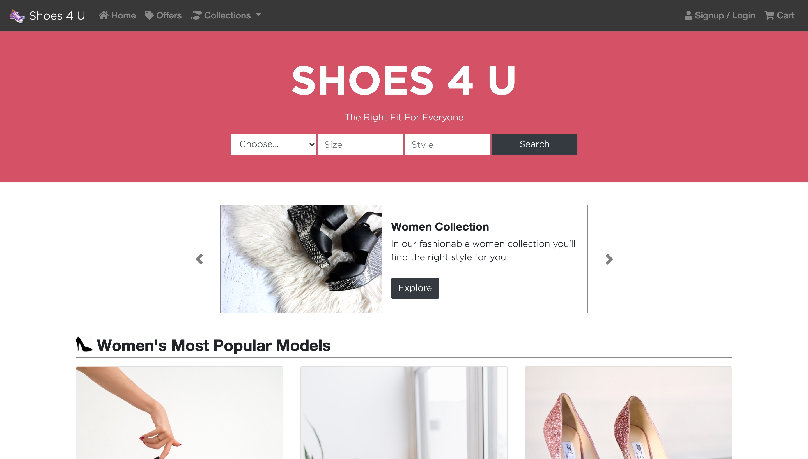

# Online Shoe Shop 

> This is an online shop for shoes, it displays its categories on the index.html page and after hitting the search button it takes you to the search results page which displays the results of a query, right now it's missing the JS implementation to complete the functionality.

The whole project was made mostly with Bootstrap 4, however, in some parts of the project, I used plain Flexbox as it was required on the specification, also on the search-results I used also CSS Grid to do the main layout. The layout of the results page was made using Bootstrap .card-columns, which in my opinion gives the layout of the cards an appealing look, solving the issue of the different sizes of the images which in consequence changes the size of each card.
One other thing I tried and proved to be very useful was the use of SASS preprocessor, it is really at they tell you, at first you don't want to use it, but after trying it I like it very much.

## Built With

- HTML and CSS
- Bootstrap 4
- VSCode and SASS

## Live Demo

[Live Demo Link](https://yors-git.github.io/Online-Shop/)

## Authors

👤 **Author1**

- GitHub: [@Yors-git](https://github.com/Yors-git)
- Twitter: [@Yors_82](https://twitter.com/Yors_82)
- Linkedin: [linkedin](https://www.linkedin.com/in/jorge-torres-8b87571a8/)

## 🤝 Contributing

Contributions, issues, and feature requests are welcome!

Feel free to check the [issues page](https://github.com/Yors-git/Online-Shop/issues).

## Show your support

Give a ⭐️ if you like this project!

## Acknowledgments

- Special thanks for the design idea to Mohammed Awad on the ZATTIX design in which this project was inspired (https://www.behance.net/gallery/24796463/ZATTIX)
